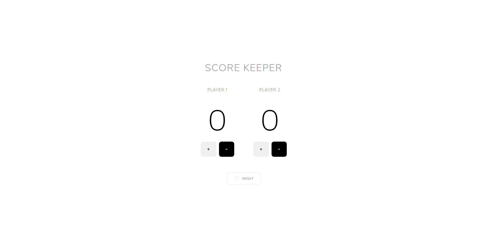

# Minimalist Score Keeper

## Preview

## What is this?

**Minimalist Score Keeper** is a clean, lightweight web application designed to track scores between two players in real-time. With its distraction-free interface, you can instantly increment or decrement scores with simple tap-friendly buttons. Whether you're playing a board game, card game, or any competitive activity, this app keeps the focus on the game itself, not the technology.

## Who is this for?

This app is perfect for:
- **Board game enthusiasts** who want a simple digital scorecard without clutter
- **Casual game players** looking for quick score tracking
- **Anyone who prefers minimal UI** — no ads, no animations, just functionality
- **Mobile and desktop users** who need responsive, touch-friendly controls

